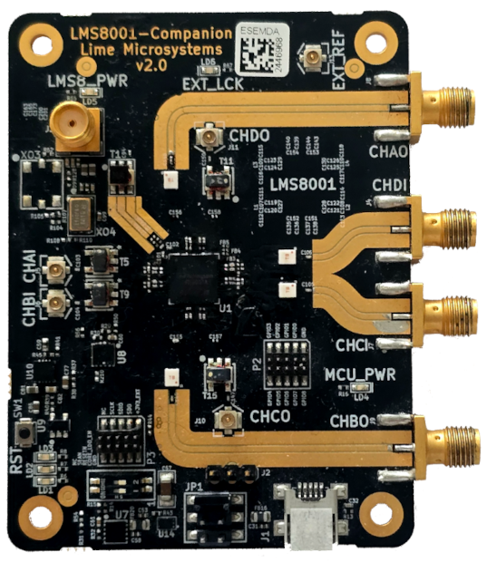

   LMS8001 Companion Board (note older v2 board pictured).

Introduction
============

.. toctree::
   :maxdepth: 2
   :hidden:

   Introduction <self>
   hardware/index
   software/index

The LMS8001 Companion Board extends the frequency range of any LimeSDR board — including the LimeSDR USB, LimeSDR Mini 2.0 and LimeSDR XTRX — enabling continuous coverage up to 10 GHz. The combination makes for a powerful and affordable solution for wideband applications such as spectrum monitoring, advanced wireless research, and development of next-generation communications.

The board is based on Lime Microsystems' LMS8001A RFIC, a highly integrated wideband frequency conversion device capable of both upconversion and downconversion across a broad RF range. It enables transmit and receive frequency translation with excellent linearity and low noise, making it ideal for applications where native SDR hardware doesn't cover higher bands.

A similar add-on was briefly made available during the original launch of the first-generation LimeSDR Mini in 2017. However, the new version launched in 2025 has numerous improvements over the initial design, with better performance, enhanced integration, and broader support. In addition to which the Companion Board and LMS8001A are now being made much more widely available.

Key Features
------------

* Lime Microsystems RF frequency shifter chip (LMS8001A)
* STM32F105 controller
* USB Type-C for power and control
* 6-pin header for easy jumper access
* U.FL and SMA connectors
* GPIO header
* SPI header
* 80.1 mm x 60.0 mm (3.15" x 2.36") 

